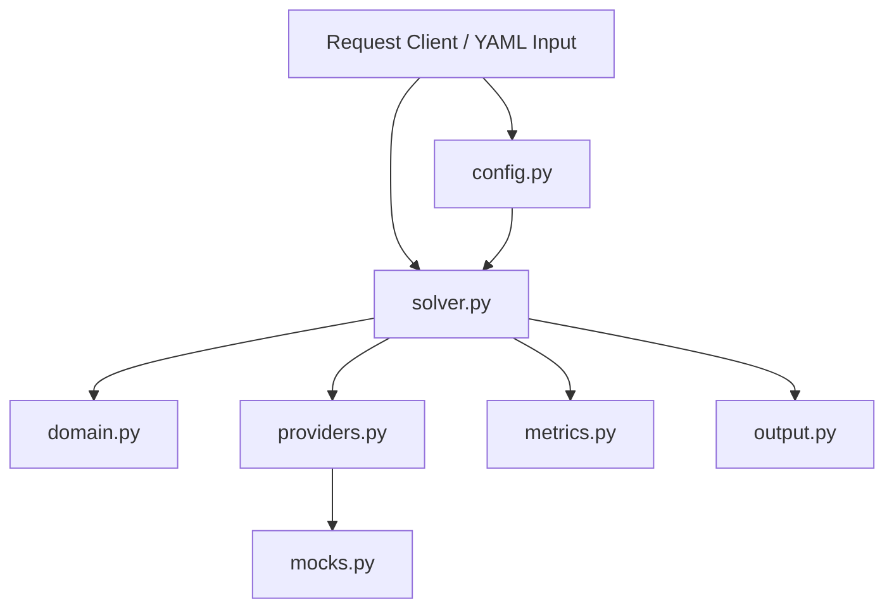
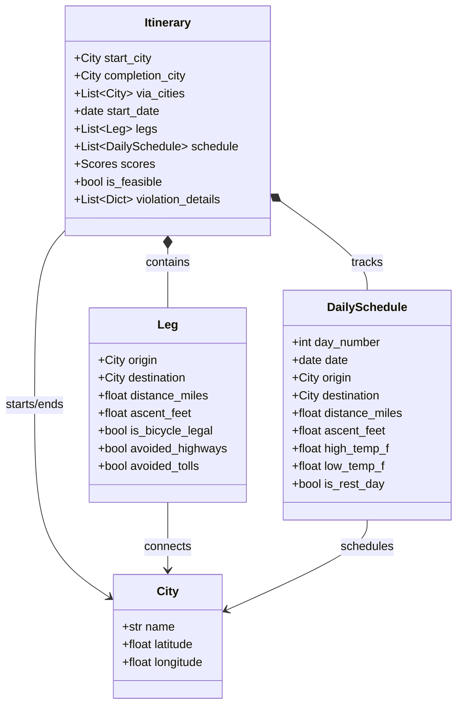

# Architecture Design

This document details the module boundaries, domain entities, and data flows of the `g2l4a` bicycle tour planner solver system.

## Module Boundaries

The system is split into distinct functional modules to ensure clean separation of concerns:

1. **`domain.py`**:
   - Houses the core dataclasses and structures representing the problem space.
   - Contains validations to enforce boundaries (e.g. coordinates limits, weight sum-to-1 bounds).
   - Zero external library dependencies, acting as the pure kernel of the codebase.

2. **`config.py`**:
   - Manages the hierarchical resolution of settings.
   - Loads and merges options recursively (deep merge) with strict priority.
   - Embeds a hardcoded built-in safety default set.

3. **`providers.py`**:
   - Standardizes the interfaces (Abstract Base Classes) for all external services.
   - Disconnects the solver from external API changes, enabling easy replacement of routing or weather engines.

4. **`mocks.py`**:
   - Implements high-fidelity, fully deterministic, math-based mock providers for offline testing, regression benchmarks, and deterministic replays.

5. **`metrics.py`**:
   - Collects running metrics (elapsed solver time, cache performance, pruned search branches, evaluations count) to ensure visibility during runtime.

6. **`solver.py`**:
   - Defines the solver orchestration interface.

7. **`output.py`**:
   - Formats itineraries, daily schedules, scores, and feasibility diagnostics into clear human-scannable and serialized schemas.

---

## Core Domain Entities & Relationships

---

## High-Level Solver Data Flow

1. **Scaffolding / Config Resolution**:
   - The runner receives the request YAML.
   - `config.py` deep-merges request overrides into the default system settings.
2. **Solver Evaluation**:
   - The solver expands candidate route orderings.
   - Pairwise leg queries are issued via `providers.py` (which queries caching databases or the OSRM/GraphHopper local adapter).
   - Candidate daily schedules are constructed and weather metrics are overlayed.
3. **Filtering & Scoring**:
   - High-temperature or low-temperature daily violations trigger fast-fail, recording structured error states.
   - Feasible routes are scored across distance, ascent, and weather preference curves.
   - Candidates are ranked in descending order of desirability.
4. **Serialization**:
   - `output.py` formats the top-K itineraries into clear markdown lists or structured JSON payload outputs.
