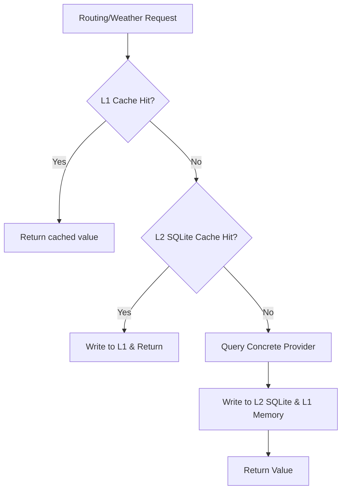

# Multi-Level Caching System (L1 & L2)

This document details the design, schemas, key generation, expiration policies, and validation rules of the `g2l4a` caching architecture.

---

## 1. Caching Precedence & Architecture

To optimize performance and eliminate redundant network queries, we employ a multi-level caching system:



---

## 2. SQLite Database Schemas (L2 Cache)

The persistent cache is stored in a SQLite database (configured by default at `.g2l4a_cache.db`). The schema consists of two tables:

### Routing Leg Cache
Stores physical segment routes. Since coordinates represent the spatial ground truth, the spatial coordinates are rounded to **6 decimal places** (approx. 11 cm precision) to serve as stable key coordinates.

```sql
CREATE TABLE routing_cache (
    origin_lat REAL,
    origin_lon REAL,
    dest_lat REAL,
    dest_lon REAL,
    routing_engine TEXT,
    profile_hash TEXT,
    distance_miles REAL,
    ascent_feet REAL,
    is_bicycle_legal INTEGER,
    avoided_highways INTEGER,
    avoided_tolls INTEGER,
    allowed_ferries INTEGER,
    allowed_borders INTEGER,
    created_at TIMESTAMP DEFAULT CURRENT_TIMESTAMP,
    PRIMARY KEY (origin_lat, origin_lon, dest_lat, dest_lon, routing_engine, profile_hash)
);
```

### Weather Metrics Cache
Stores daily temperature bounds.

```sql
CREATE TABLE weather_cache (
    city_lat REAL,
    city_lon REAL,
    travel_date TEXT,
    high_temp_f REAL,
    low_temp_f REAL,
    is_forecast INTEGER,
    fetched_at TIMESTAMP DEFAULT CURRENT_TIMESTAMP,
    PRIMARY KEY (city_lat, city_lon, travel_date, is_forecast)
);
```

---

## 3. Key Design and Hashing Rules

### Composite Profile Hashing
Routing metrics differ depending on routing preferences (e.g. avoiding highways or tolls). To ensure cache keys remain profile-aware, the system hashes routing configurations:
1. Extracts routing parameters: `avoid_highways`, `avoid_tolls`, `allow_ferries`, `allow_international_borders`.
2. Standardizes missing parameters as `True`.
3. Sorts parameters alphabetically to ensure deterministic string representation.
4. Serializes to JSON and hashes using SHA-256 to create a `profile_hash`.

---

## 4. TTL Expiration Policies

To guarantee that calculations are both correct and up-to-date, we enforce strict invalidation rules:

* **Short-Term Forecasts (within 14-day window)**:
  - Forecasts change constantly. Therefore, forecast records (`is_forecast = 1`) carry a TTL of **24 hours**.
  - Cache hits older than 24 hours are pruned from the L2 database and evicted from L1 memory.
* **Climatology Records (outside 14-day window)**:
  - Historical weather norms do not change significantly. These records (`is_forecast = 0`) carry a TTL of **30 days**.

---

## 5. Thread Safety

All database write and read workflows are fully thread-safe. The `SQLiteCacheManager` utilizes **Thread-Local Storage** (`threading.local()`) so that each operating execution thread manages its own isolated connection to the SQLite engine, preventing query locks, transaction overlaps, or data corruption.
