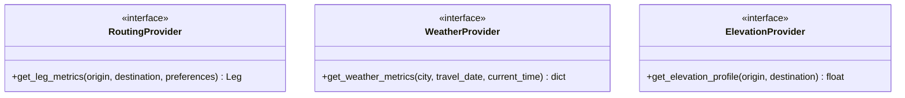

# Provider Integration Architecture

This document outlines the standard architecture for external integrations (`g2l4a` data providers), concrete adapter structures, concurrency configurations, and strategies to handle outages, failures, and rate limits.

---

## 1. Provider Interfaces

The system defines pure Abstract Base Classes (ABCs) in [src/providers.py](file:///home/mev/source/g2l4a/src/providers.py) to decouple the core routing solver from external web service clients:



---

## 2. Concurrency and Bulk leg Hashing

To accelerate initialization and state transitions when executing searches across large sequences of cities, the system provides a parallel bulk resolver.

### `BulkLegFetcher`
The [src/bulk_fetcher.py](file:///home/mev/source/g2l4a/src/bulk_fetcher.py) resolver aggregates multiple independent leg routing calculations and distributes them concurrently across a configured worker pool (`ThreadPoolExecutor`). 

- **Worker Cap**: Configured via the `cache.concurrency_limit` default (default: `10` threads).
- **Execution Workflow**:
  1. Receives list of requested path legs.
  2. Submits queries concurrently to avoid serial network blocking.
  3. Re-assembles resolved leg items in the requested order.

---

## 3. Outage Failures and Strategy

To prevent routing optimization runs from failing due to temporary provider outages or rate limits, the following strategy is utilized:

### Robust Rate Limiting
- **Throttling & Backoff**: All concrete adapters wrapper requests with retry logic utilizing an exponential backoff.
- **Fail-Fast Warnings**: If retries exceed thresholds, the wrapper raises clear warnings rather than returning corrupted values.

### Failover Outage Behavior
1. **Fallback to Cache**: Active L2 persistent SQLite cache guarantees that repeat routes can run entirely offline or in the event of provider outages.
2. **Provider Failures**: If a connection is interrupted and the cache is missed, the system raises a descriptive provider-level error rather than silently returning incorrect calculations.
3. **Controlled Warnings**: Weather anomalies or elevation dropouts return explicit errors/warnings that propagate to the itinerary's `violation_details` so the user is immediately aware of why certain options could not be validated.

---

## 4. Open-Meteo Weather Provider

The solver defaults to the deterministic `mock` weather provider for fast local runs.
You can opt in to Open-Meteo as the weather source through config:

```yaml
weather_provider:
    name: "open_meteo"
    timeout_seconds: 8.0
    climate_model: "CMCC_CM2_VHR4"
```

Runtime behavior:
- For travel dates within 14 days of the run date, the provider uses Open-Meteo forecast temperatures.
- For dates outside that horizon, it uses the Open-Meteo climate endpoint.
- On any Open-Meteo failure (network, payload, parsing), it now falls back to state-capital monthly normals first, then to deterministic mock weather.

### State-Capital Monthly Normals Fallback

The intermediate fallback provider reads monthly average high/low temperatures for all 50 US state capitals from a local dataset:

```yaml
weather_provider:
    name: "open_meteo"
    capital_monthly_normals_path: "data/state_capitals_monthly_normals.json"
```

You can also select this provider directly:

```yaml
weather_provider:
    name: "state_capital_monthly_normals"
```

Dataset refresh tooling:
- Script: `scripts/build_state_capitals_monthly_normals.py`
- Source approach: fetch each capital's Wikipedia climate table and extract monthly Fahrenheit high/low normals.
- Output: `data/state_capitals_monthly_normals.json`

The existing L1/L2 caching layer still applies to Open-Meteo responses, preventing repeated calls for the same city/date/forecast mode and reducing API quota consumption.

### Attribution Compliance

Open-Meteo data is published under CC BY 4.0 and requires attribution with a link where data is displayed. When `weather_provider.name` is set to `open_meteo`, generated markdown reports include a "Data Attribution" section with:
- Link to Open-Meteo: `https://open-meteo.com/`
- Link to CC BY 4.0 licence: `https://creativecommons.org/licenses/by/4.0/`
- Note that data is transformed into itinerary-level summaries.

---

## 5. GraphHopper Routing Provider (Self-Hosted)

The solver can now use GraphHopper for distance and ascent instead of deterministic mock routing.

### Local GraphHopper Startup (Docker Compose)

This repository includes a Compose setup in `docker-compose.graphhopper.yml` and a container entrypoint script in `docker/graphhopper/entrypoint.sh`.

```bash
# Standalone docker-compose binary
GH_OSM_URL=https://download.geofabrik.de/north-america/us/texas-latest.osm.pbf \
docker-compose -f docker-compose.graphhopper.yml up -d --build

# Or, if your system provides `docker compose`
GH_OSM_URL=https://download.geofabrik.de/north-america/us/texas-latest.osm.pbf \
docker compose -f docker-compose.graphhopper.yml up -d --build
```

Notes:
- Data and graph cache are persisted under `.graphhopper/`.
- If `GH_OSM_FILE` is not present in the mounted volume, set `GH_OSM_URL` so the container can download an extract.
- The first import can take minutes to hours depending on extract size.
- If you hit `permission denied` on `/var/run/docker.sock`, add your user to the `docker` group or run with elevated privileges.

### g2l4a Request Configuration

```yaml
routing_provider:
    name: graphhopper
    base_url: "http://localhost:8989"
    profile: "car"
    timeout_seconds: 12.0
    purge_mock_cache: false
```

Notes:
- `profile` maps directly to the GraphHopper route profile. The Compose bootstrap uses upstream config defaults, which include `car`.
- Use `bike` only if your GraphHopper config enables a bike profile.
- Distances come from `paths[0].distance` (meters) and are converted to miles.
- Climbing comes from `paths[0].ascend` (meters) and is converted to feet.

### Road Surface Classification & Gravel Avoidance

The GraphHopper provider queries segment-level path details (`road_class`, `surface`, `track_type`) using HTTP POST requests.
- **Segment Breakdown**: The daily travel schedule markdown and text reports display exact paved/gravel mileage breakdowns (e.g. `12.7 mi (12.0 mi paved, 0.6 mi gravel)`).
- **Gravel Avoidance**: If the routing preference `avoid_gravel: true` is configured, the provider submits a custom routing model to GraphHopper that scales priority by `0.1` for unpaved surfaces and track grades 2–5, dynamically rerouting to favor paved roads.

### Route Cache Provenance and Purge

Routing cache rows now store a `source` tag in addition to `routing_engine`.

- Example sources: `mockroutingprovider`, `graphhopper`.
- Cache lookups for routing are source-aware to avoid cross-provider reuse.
- Optional purge behavior: set `routing_provider.purge_mock_cache: true` to remove legacy mock route rows when running GraphHopper.

### Example and Test Commands

Default Heartland scenario:

```bash
/home/mev/source/g2l4a/.venv/bin/python -m src.example_report \
    examples/heartland-fixed-date.yaml \
    --format all \
    --cache-db .g2l4a_graphhopper_cache.db
```

If you need a no-server fallback, copy an example and remove its `routing_provider` block.

Integration test (auto-skips when local GraphHopper is unavailable):

```bash
/home/mev/source/g2l4a/.venv/bin/python -m pytest tests/test_graphhopper_integration.py -q
```

### GraphHopper Operations Runbook

Use this checklist when running scenario analysis with self-hosted routing:

1. Ensure GraphHopper is running before any solver/report command that uses `routing_provider.name: graphhopper`.
2. Verify readiness with:

```bash
curl -fsS http://localhost:8989/info | head -c 300 && echo
```

3. Run reports only after `/info` returns JSON payload.

#### Start/Stop Workflow

```bash
# Start using existing downloaded/imported data (fast path)
docker-compose -f docker-compose.graphhopper.yml up -d

# Stop service
docker-compose -f docker-compose.graphhopper.yml down
```

Helper one-liners (equivalent wrappers):

```bash
./scripts/graphhopper-stop.sh
./scripts/graphhopper-start.sh
./scripts/graphhopper-status.sh
```

Memory preset examples:

```bash
./scripts/graphhopper-start.sh --mem-preset high
./scripts/graphhopper-start.sh --mem-preset xlarge --build
./scripts/graphhopper-start.sh --mem-preset xxlarge --build
```

Supported presets: `low`, `medium`, `high`, `xlarge`, `xxlarge`.
The `xxlarge` preset maps to `-Xms24g -Xmx48g`, which fits a host budget where about 64 GB remains available for CPU-side workloads.
The alias `./scripts/grasshopper-start.sh` forwards to the same helper.

Because `.graphhopper/` is bind-mounted, the downloaded OSM file and imported graph are reused across restarts.

#### One-Time Regional Bootstrap vs Reuse

- First startup for a new region can take minutes to hours (download + import + CH preparation).
- Subsequent restarts are much faster if both files remain:
    - `.graphhopper/map.osm.pbf`
    - `.graphhopper/graph-cache/`
- Keep these files to reuse the same regional graph for many scenarios.

#### Updating OSM Data (Occasional Refresh)

To refresh routing data with a newer extract (for example monthly or quarterly):

```bash
docker-compose -f docker-compose.graphhopper.yml down
rm -rf .graphhopper/graph-cache
rm -f .graphhopper/map.osm.pbf
GH_OSM_URL=https://download.geofabrik.de/north-america-latest.osm.pbf \
docker-compose -f docker-compose.graphhopper.yml up -d --build
```

Helper one-liner (requires explicit confirmation):

```bash
./scripts/graphhopper-refresh.sh --yes
```

Notes:
- Deleting `graph-cache` forces graph rebuild for the current OSM file.
- Deleting both `graph-cache` and `map.osm.pbf` forces fresh download and rebuild.
- Use a broad extract (for example North America) when scenarios may cross US/Canada borders.

#### Route Cache Reuse Expectations

- Solver route cache is persisted in SQLite (`.g2l4a_cache.db` by default, or your selected `--cache-db`).
- Repeated city-pair legs benefit from cache hits, reducing GraphHopper API calls in later runs.
- Cache entries are source-scoped (`graphhopper` vs mock) to avoid cross-provider contamination.
