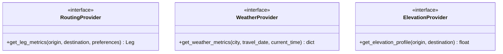

# Provider Integration Architecture

This document outlines the standard architecture for external integrations (`g2l4a` data providers), concrete adapter structures, concurrency configurations, and strategies to handle outages, failures, and rate limits.

---

## 1. Provider Interfaces

The system defines pure Abstract Base Classes (ABCs) in [src/providers.py](file:///home/mev/source/g2l4a/src/providers.py) to decouple the core routing solver from external web service clients:

---

## 2. Concurrency and Bulk leg Hashing

To accelerate initialization and state transitions when executing searches across large sequences of cities, the system provides a parallel bulk resolver.

### `BulkLegFetcher`
The [src/bulk_fetcher.py](file:///home/mev/source/g2l4a/src/bulk_fetcher.py) resolver aggregates multiple independent leg routing calculations and distributes them concurrently across a configured worker pool (`ThreadPoolExecutor`). 

- **Worker Cap**: Configured via the `cache.concurrency_limit` default (default: `10` threads).
- **Execution Workflow**:
  1. Receives list of requested path legs.
  2. Submits queries concurrently to avoid serial network blocking.
  3. Re-assembles resolved leg items in the requested order.

---

## 3. Outage Failures and Strategy

To prevent routing optimization runs from failing due to temporary provider outages or rate limits, the following strategy is utilized:

### Robust Rate Limiting
- **Throttling & Backoff**: All concrete adapters wrapper requests with retry logic utilizing an exponential backoff.
- **Fail-Fast Warnings**: If retries exceed thresholds, the wrapper raises clear warnings rather than returning corrupted values.

### Failover Outage Behavior
1. **Fallback to Cache**: Active L2 persistent SQLite cache guarantees that repeat routes can run entirely offline or in the event of provider outages.
2. **Provider Failures**: If a connection is interrupted and the cache is missed, the system raises a descriptive provider-level error rather than silently returning incorrect calculations.
3. **Controlled Warnings**: Weather anomalies or elevation dropouts return explicit errors/warnings that propagate to the itinerary's `violation_details` so the user is immediately aware of why certain options could not be validated.
