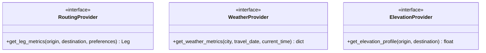

# Provider Integration Architecture

This document outlines the standard architecture for external integrations (`g2l4a` data providers), concrete adapter structures, concurrency configurations, and strategies to handle outages, failures, and rate limits.

---

## 1. Provider Interfaces

The system defines pure Abstract Base Classes (ABCs) in [src/providers.py](file:///home/mev/source/g2l4a/src/providers.py) to decouple the core routing solver from external web service clients:



---

## 2. Concurrency and Bulk leg Hashing

To accelerate initialization and state transitions when executing searches across large sequences of cities, the system provides a parallel bulk resolver.

### `BulkLegFetcher`
The [src/bulk_fetcher.py](file:///home/mev/source/g2l4a/src/bulk_fetcher.py) resolver aggregates multiple independent leg routing calculations and distributes them concurrently across a configured worker pool (`ThreadPoolExecutor`). 

- **Worker Cap**: Configured via the `cache.concurrency_limit` default (default: `10` threads).
- **Execution Workflow**:
  1. Receives list of requested path legs.
  2. Submits queries concurrently to avoid serial network blocking.
  3. Re-assembles resolved leg items in the requested order.

---

## 3. Outage Failures and Strategy

To prevent routing optimization runs from failing due to temporary provider outages or rate limits, the following strategy is utilized:

### Robust Rate Limiting
- **Throttling & Backoff**: All concrete adapters wrapper requests with retry logic utilizing an exponential backoff.
- **Fail-Fast Warnings**: If retries exceed thresholds, the wrapper raises clear warnings rather than returning corrupted values.

### Failover Outage Behavior
1. **Fallback to Cache**: Active L2 persistent SQLite cache guarantees that repeat routes can run entirely offline or in the event of provider outages.
2. **Provider Failures**: If a connection is interrupted and the cache is missed, the system raises a descriptive provider-level error rather than silently returning incorrect calculations.
3. **Controlled Warnings**: Weather anomalies or elevation dropouts return explicit errors/warnings that propagate to the itinerary's `violation_details` so the user is immediately aware of why certain options could not be validated.

---

## 4. Open-Meteo Weather Provider

The solver defaults to the deterministic `mock` weather provider for fast local runs.
You can opt in to Open-Meteo as the weather source through config:

```yaml
weather_provider:
    name: "open_meteo"
    timeout_seconds: 8.0
    climate_model: "CMCC_CM2_VHR4"
```

Runtime behavior:
- For travel dates within 14 days of the run date, the provider uses Open-Meteo forecast temperatures.
- For dates outside that horizon, it uses the Open-Meteo climate endpoint.
- On any Open-Meteo failure (network, payload, parsing), it now falls back to state-capital monthly normals first, then to deterministic mock weather.

### State-Capital Monthly Normals Fallback

The intermediate fallback provider reads monthly average high/low temperatures for all 50 US state capitals from a local dataset:

```yaml
weather_provider:
    name: "open_meteo"
    capital_monthly_normals_path: "data/state_capitals_monthly_normals.json"
```

You can also select this provider directly:

```yaml
weather_provider:
    name: "state_capital_monthly_normals"
```

Dataset refresh tooling:
- Script: `scripts/build_state_capitals_monthly_normals.py`
- Source approach: fetch each capital's Wikipedia climate table and extract monthly Fahrenheit high/low normals.
- Output: `data/state_capitals_monthly_normals.json`

The existing L1/L2 caching layer still applies to Open-Meteo responses, preventing repeated calls for the same city/date/forecast mode and reducing API quota consumption.

### Attribution Compliance

Open-Meteo data is published under CC BY 4.0 and requires attribution with a link where data is displayed. When `weather_provider.name` is set to `open_meteo`, generated markdown reports include a "Data Attribution" section with:
- Link to Open-Meteo: `https://open-meteo.com/`
- Link to CC BY 4.0 licence: `https://creativecommons.org/licenses/by/4.0/`
- Note that data is transformed into itinerary-level summaries.
