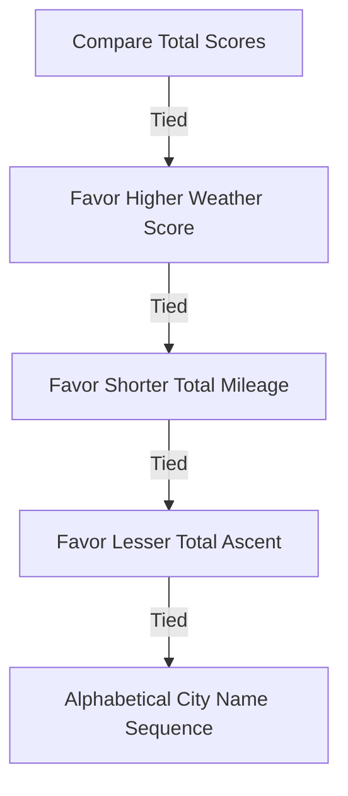

# Desirability Scoring & Ranking Engine

This document defines the mathematical objectives, comfort parameters, geodesic baselines, and deterministic tie-breaking logic of the `g2l4a` Desirability Scoring Engine.

---

## 1. Multi-Objective Weighted Sum

To rank candidate itineraries, the system combines three conflicting soft objectives (weather, distance, and hills) into a single aggregate score:

$$\text{Total Score} = w_{\text{weather}} \cdot S_{\text{weather}} + w_{\text{distance}} \cdot S_{\text{distance}} + w_{\text{hills}} \cdot S_{\text{hills}}$$

Where:
- Weights ($w_i$) are non-negative and sum to $1.0$.
- Each sub-objective score ($S_i$) is normalized to the **`[0.0, 1.0]`** range, where `1.0` is the most desirable and `0.0` is the least.

---

## 2. Objective Formulations

### A. Weather Comfort Score ($S_{\text{weather}}$)
Favors temperate riding conditions. Evaluated against the ideal comfort target high temperature $T_{\text{ideal}} = 70^{\circ}\text{F}$ with a linear decay tolerance bandwidth $T_{\text{tol}} = 20^{\circ}\text{F}$:

$$s_i = \max\left(0.0, 1.0 - \frac{|T_{\text{high}} - 70.0|}{20.0}\right)$$

$$S_{\text{weather}} = \frac{1}{N_{\text{days}}} \sum_{i=1}^{N_{\text{days}}} s_i$$

- A daily high of $70^{\circ}\text{F}$ yields a perfect $1.0$.
- Highs of $50^{\circ}\text{F}$ or $90^{\circ}\text{F}$ decay to $0.0$.

### B. Distance Efficiency Score ($S_{\text{distance}}$)
Favors shorter routes. Compares the actual itinerary routing distance $D_{\text{actual}}$ against the shortest sequence geodesic distance baseline $D_{\text{base}}$:

$$D_{\text{base}} = \sum_{j=1}^{N_{\text{cities}}-1} \text{Haversine}(C_j, C_{j+1})$$

$$S_{\text{distance}} = \min\left(1.0, \frac{D_{\text{base}}}{D_{\text{actual}}}\right)$$

- Perfect direct geodesic paths yield a distance score of $1.0$.
- Detours that double the actual travel mileage yield a score of $0.5$.

### C. Climbing Burden Score ($S_{\text{hills}}$)
Favors flatter routes. Normalizes total climb elevation relative to the maximum allowable daily ascent cap ($A_{\text{cap}} = \text{max\_climb\_ft\_per\_day}$ from constraints):

$$S_{\text{hills}} = 1.0 - \frac{A_{\text{total}}}{N_{\text{travel\_days}} \cdot A_{\text{cap}}}$$

- An itinerary with zero ascent yields a climbing score of $1.0$.
- Climbing exactly at the daily limit on all travel days yields a score of $0.0$.

---

## 3. Stable Tie-Breaking Ranking Precedence

To guarantee process-stable determinism across optimization runs, identical total scores are sorted using strict tie-breaker metrics:

This multi-stage tie-breaker guarantees that ranking sequences are 100% deterministic and reproducible across all platforms.
