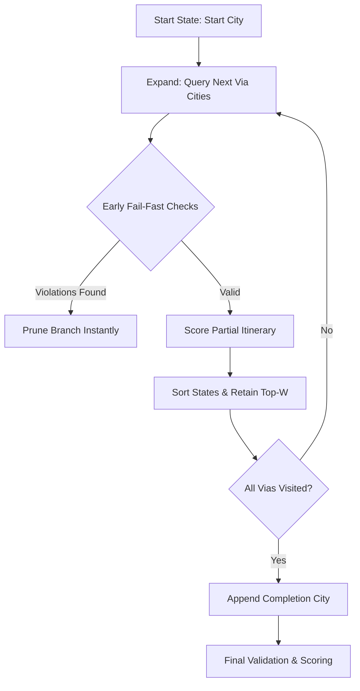

# Route Search Engine (Anytime Beam Search)

This document details the algorithm, heuristics, anytime properties, timeout controls, and pruning mechanisms of the `g2l4a` Route Search Engine.

---

## 1. Algorithmic Overview

To optimize multi-day long-distance bicycle routes with up to 50 via-cities within tight execution budgets, the solver utilizes a **Beam Search** algorithm. While standard backtracking TSP is $O(N!)$, Beam Search caps search branches at each depth to a narrow beam width ($W$), reducing complexity to a highly scalable $O(N^2 \cdot W)$ polynomial time bounds.

---

## 2. Warm-Start Heuristic Seeding

Before beginning full beam exploration, the engine runs a fast, constructive heuristic to establish an initial complete path instantly:

### Nearest-Neighbor (NN) TSP
1. Starts at the user's `start_city`.
2. Repeatedly selects the nearest unvisited `via_city` using great-circle Haversine geodesic calculations.
3. Appends the `completion_city` once all via cities are ordered.
4. Generates daily schedules, runs constraints validation, and scores the resulting path.

This constructive seed guarantees that even under extreme timeouts or highly restricted budgets, a valid sorted sequence is available instantly (implementing true **anytime** characteristics).

---

## 3. Beam Search Queue & Fail-Fast Pruning Heuristics

The search builds itineraries incrementally, day-by-day:



### Fail-Fast Pruning Heuristics
During the expansion loop, as each new day is added:
1. Destination daily weather high $T_{\text{high}}$ is verified against maximum and minimum comfort limits.
2. Daily distance miles and climbing ascent are verified against maximum effort caps.
3. If *any* check returns violations, the branch is **pruned instantly** before evaluating subsequent cities, preventing search-tree inflation.

---

## 4. Strict Timeout Budgeting

To enforce compliance with execution budgets, the engine checks elapsed time during candidate state transitions:

- **Abortion Mechanism**: If elapsed duration exceeds the configured `max_search_minutes` (default: `10`), the solver immediately aborts full search.
- **Graceful Return**: Returns the best feasible complete itinerary found so far (falling back to the warm-start TSP seed if the search halted early).

---

## 5. Configuration Options

Search characteristics can be adjusted in the `solver_constraints` block of [config/defaults.yaml](file:///home/mev/source/g2l4a/config/defaults.yaml):
```yaml
solver_constraints:
  max_total_cities: 50
  max_search_minutes: 10.0
  beam_width: 10   # Higher values improve route quality but increase runtime
```
